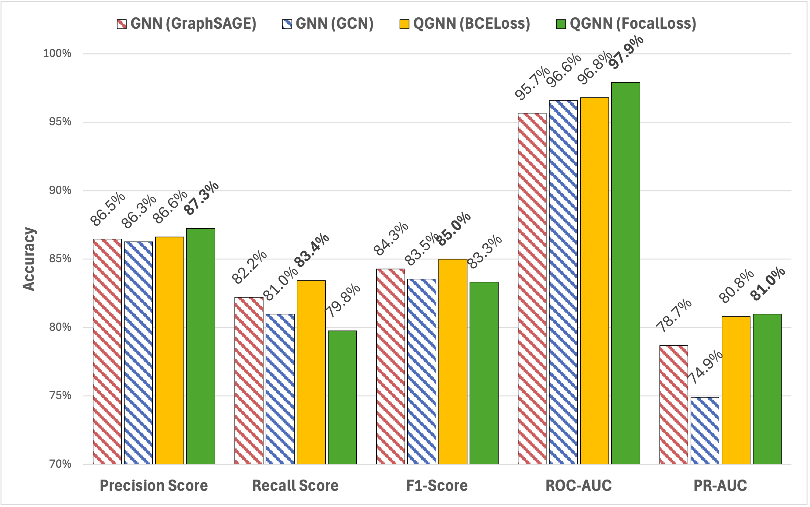

<!-- markdownlint-disable first-line-h1 -->
<!-- markdownlint-disable html -->
<!-- markdownlint-disable no-duplicate-header -->

<a name="top"></a>
<div align="center">
  
</div>

---

<div align="center">
   <a href="mailto:erik.staszewski@gmail.com"><b>Email Me</b></a> | <a href="https://www.linkedin.com/in/estaszewski/"><b>My LinkedIn</b></a></b></a> | <a href="https://www.equal1.com/"><b>Equal1</b></a></b></a> | <a href="https://www.equal1.com/bell-1"><b>Bell-1</b></a></b></a>
</div>

## Introduction

This project, by Erik Staszewski under the supervision of David Redmond for Equal1, seeks to implement and extend quantum computing techniques for credit card fraud detection. The primary objective is to construct and compare the performance of a classical Graph Neural Network (GNN) with a Quantum Graph Neural Network (QGNN) for binary classification of fraudulent and non-fraudulent credit card transactions.

Currently, the quantum components are being simulated using NVIDIA CUDA backends, hence the slower operation time. Once Equal1's new quantum hardware is released, these quantum operations will run with performance times comparable to, or exceeding, their classical counterparts, enabling real-time quantum-enhanced machine learning with improved results.

Performance is evaluated using precision, recall, and $F_1$-scores, and plotted using Receiver Operating Characteristic (ROC) and Precision-Recall (PR) Curves.

<a name="top"></a>
<div align="center">
  
</div>

## Model Architecture

**GNN Model**

* The GNN model consists of 3 GraphSAGE or GCN convolutional layers, each followed by batch normalization, and a GeLU actiation.
* A dense layer maps the final embeddings to a single scalar output, followed by a sigmoid activation for fraud classification.
* The GNN model is trained for 100 epochs, optimized with Adam, has BCELoss as the loss function, a weight-decay of $1e^{-4}$, and a learning rate of 0.01.

<a name="top"></a>
<div align="center">
  
</div>

**QGNN Model**

* The QGNN model consists of a single SGConv layer, followed by ReLU actication.
* A single-qubit quantum layer is used, implementing RX and RY gates, followed by a dense layer, and a sigmoid activation for fraud classification.
* The QGNN BCELoss model is trained for 220 epochs, optimized using Adam, has BCELoss as the loss function, a weight decay of $1e^{-4}$, and a learning rate of 0.01.
* The QGNN FocalLoss model is trained for 280 epochs, optimized using Adam, has FocalLoss as the loss function with any Alpha value and a Gamma value of 5.5, and a learning rate of 0.01

<a name="top"></a>
<div align="center">
  
</div>

## Results

The results are shown below. As shown below, the QGNN BCELoss model outperforms both GNN models, and the QGNN FocalLoss model outperforms the QGNN BCELoss model in three metrics.

<div align="center">

<table>
  <thead>
    <tr>
      <th rowspan="3">Metric</th>
      <th colspan="2">GNN</th>
      <th colspan="2">QGNN</th>
    </tr>
    <tr>
      <th>GraphSAGE</th>
      <th>GCN</th>
      <th colspan="2">SGConv</th>
    </tr>
    <tr>
      <th colspan="2">BCELoss</th>
      <th>BCELoss</th>
      <th>FocalLoss</th>
    </tr>
  </thead>
  <tbody>
    <tr>
      <td>Precision Score</td>
      <td>86.45%</td> <td>86.27%</td> <td>86.62%</td> <td><strong>87.25%</strong></td>
    </tr>
    <tr>
      <td>Recall Score</td>
      <td>82.21%</td> <td>80.98%</td> <td><strong>83.44%</strong></td> <td>79.75%</td>
    </tr>
    <tr>
      <td>$F_1$ Score</td>
      <td>84.28%</td> <td>83.54%</td> <td><strong>85.00%</strong></td> <td>83.33%</td>
    </tr>
    <tr>
      <td>ROC AUC</td>
      <td>95.65%</td> <td>96.59%</td> <td>96.79%</td> <td><strong>97.91%</strong></td>
    </tr>
    <tr>
      <td>PR AUC</td>
      <td>78.68%</td> <td>74.90%</td> <td>80.80%</td> <td><strong>80.98%</strong></td>
    </tr>
  </tbody>
</table>

</div>

> [!NOTE]
> Best results are shown in bold.

## How to Run

This project includes both a classical Graph Neural Network (GNN) and a hybrid Quantum Graph Neural Network (QGNN) for credit card fraud detection. The QGNN uses a simulated quantum circuit based on NVIDIA's CUDA-Q framework.

### Hardware Requirements

* <a href="https://www.equal1.com/bell-1">Equal1's Bell-1 Quantum Computer</a></a> for high-speed QGNN results

### System Requirements

* OS: Linux
* Python 3.10+
* NVIDIA GPU with CUDA support (for CUDA-Q simulation)

### Code Preparation

Clone the Repository:

```shell
git clone https://github.com/estasz/GNN-QGNN-FraudDetection.git
cd GNN-QGNN-FraudDetection
```

Open the file:

```shell
jupyter notebook GNN-QGNN.ipynb
```

And run the model. Feel free to add your own dataset.

## License

This repository is licensed under the Apache 2.0 License. The source code is free to use, modify, and distribute under the terms of this license. Use of the trained models may be subject to additional terms as defined by Equal1. 
